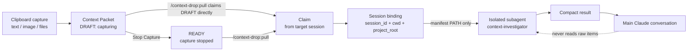
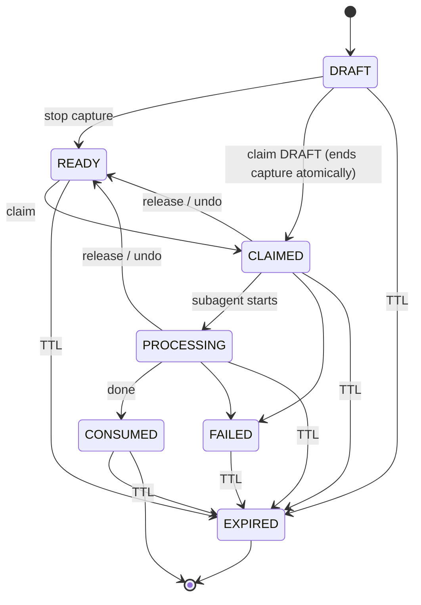

# Context Drop — Architecture

Context Drop is a local-only desktop utility that collects a burst of raw
context — screenshots, UI images, browser console output, server/debug logs,
JSON responses, network results, stack traces, external docs, and multiple
copied text fragments, copied images, or Finder/Explorer files — into a
temporary **Context Packet**, then routes that packet to a chosen Claude Code
session where an **isolated subagent** processes it and returns a compact
result. The raw material never lands in the main Claude conversation.

## The whole point

The single design invariant everything else serves:

```
raw context  ->  Context Drop Packet  ->  isolated Claude Code subagent  ->  compact result  ->  main Claude
```

The forbidden flow — the one Context Drop exists to prevent — is:

```
raw context  ->  main Claude  ->  subagent        (FORBIDDEN)
```

If the raw context reaches the main conversation first, the whole benefit is
lost: the main context window is already polluted with logs, image bytes, and
large JSON before any delegation happens. Context Drop keeps the raw material
in a local packet, hands only *metadata* (a manifest path plus item counts,
kinds, sizes, and hashes) to the main agent, and lets the isolated
`context-investigator` subagent be the only reader of the actual bytes.

## End-to-end data flow



Step by step:

1. **Clipboard / drop → Packet.** With Capture ON, the clipboard monitor appends
   each new item (text, image, or file list) to the current `DRAFT` packet.
   Files **dropped onto the window** are appended the same way (reusing the same
   size-budget enforcement and atomic append) and work even when Capture is OFF,
   since a drop is an explicit one-shot capture rather than background
   monitoring. Items are written to disk as files; only references and hashes are
   recorded in the metadata authority.
2. **Packet → Claim.** The destination is *not* decided here. The packet is
   captured with no destination and simply waits.
3. **Claim → Claude session binding.** When `/context-drop:pull` runs inside a
   Claude Code session, that session claims the packet and stamps its routing
   identity (`session_id` + `cwd` + `project_root`) onto it.
4. **Binding → isolated subagent.** The main agent passes only the manifest
   **path** to the `context-investigator` subagent. The subagent reads the raw
   items in isolation.
5. **Subagent → compact result → main Claude.** The subagent returns a compact,
   structured result. The main agent relays it and marks the packet consumed.

## The routing model: "capture first, route later"

This is the most important architectural decision.

At capture time a packet's destination is **`NONE`**. Nothing about where the
packet will go is known or guessed while you are collecting material. The
destination is decided **only** when `/context-drop:pull` runs *from the target
Claude Code session itself*.

### Routing identity

When a session claims a packet, the stored routing identity is:

```
session_id  +  cwd  +  project_root
```

- **`session_id`** comes from `CLAUDE_CODE_SESSION_ID`, which is verified to be
  set inside Claude Code sessions. It is what distinguishes the *same repository
  open in multiple tabs* — each tab is its own session.
- **`project_root`** is `git rev-parse --show-toplevel` when the session is in a
  git repository, otherwise the canonicalized `cwd`. A monorepo subdirectory is
  therefore **not** treated as a different project unless the git root actually
  differs.

The Anthropic account id is **never** used for routing. Routing also never keys
off the most-recently-opened project, the foreground app, the window title, the
account, or the desktop UI's current selection. The desktop UI selection is a
*view*, not a router. This is what lets Context Drop support 20+ parallel
sessions and 10+ Claude accounts without cross-talk.

### Claim priority

When a session claims, the target packet is chosen deterministically:

1. the current `DRAFT` packet if it has `items > 0`, else
2. the newest `READY` packet, else
3. `NO_PACKET`.

Claiming a `DRAFT` **atomically ends capture** (`DRAFT -> CLAIMED`); any append
attempted after that point is refused.

## Packet state machine

```
States: DRAFT · READY · CLAIMED · PROCESSING · CONSUMED · FAILED · EXPIRED
```

| State        | Meaning                                            |
|--------------|----------------------------------------------------|
| `DRAFT`      | Capturing — clipboard items are being appended.    |
| `READY`      | Capture stopped, not yet handed to a session.      |
| `CLAIMED`    | Bound to a specific Claude session.                |
| `PROCESSING` | Subagent has started.                              |
| `CONSUMED`   | Done.                                              |
| `FAILED`     | Terminal failure.                                  |
| `EXPIRED`    | Aged out via TTL.                                  |

Transitions:



- **Main transitions:** `DRAFT -> READY`, `DRAFT -> CLAIMED`,
  `READY -> CLAIMED`, `CLAIMED -> PROCESSING`, `PROCESSING -> CONSUMED`.
- **Recovery transitions:** `CLAIMED/PROCESSING -> READY` (release/undo),
  `CLAIMED/PROCESSING -> FAILED`, and `* -> EXPIRED` (TTL).

Note that **release/undo returns a packet to `READY`** — it is a *routing*
operation only. See [Undo](#undo-is-routing-only).

## SQLite as the single authority

Context Drop uses a **bundled SQLite database** (WAL mode) as the authoritative
store of packet and claim metadata. The on-disk manifest is a *projection* of
that authority, not a second source of truth.

Database configuration:

- **WAL** journaling mode
- **`busy_timeout` = 5000 ms**
- **`foreign_keys` = ON**
- **`synchronous` = NORMAL**
- Schema version tracked via **`PRAGMA user_version`** (current: **v1**)

Tables: `packets`, `packet_items`, `claims`, `settings`, `migrations`.

State-changing operations run inside transactions (`BEGIN IMMEDIATE`):
finalize, claim, append-state-check, undo, and release. Because SQLite is the
authority, the metadata is consistent even when the desktop app and the CLI act
at the same time.

### Manifest is a projection

Each packet directory contains a `manifest.json` (`schemaVersion = 1`) with:

```
schemaVersion, id, state, createdAt, updatedAt (RFC3339),
items[], claim (present only once CLAIMED)
```

Each `items[]` entry: `id`, `kind`, `mimeType`, `relativePath`, `byteSize`,
`sha256`, `createdAt`. The `claim` object: `sessionId`, `cwd`, `projectRoot`,
`projectName`, `configDir` (optional; diagnostics only), `claimedAt`.

Raw file contents are **never inlined** into the manifest — only references
(relative paths) plus `sha256` hashes and sizes. The manifest is what the
subagent is pointed at; the actual bytes live beside it as individual files.

## Atomic claim, and the append-vs-claim race

Two independent actors — the desktop capture loop appending items, and a Claude
session claiming — can touch the same `DRAFT` packet concurrently. Two races
must be handled:

1. **Two sessions claim the same packet at once.** A claim is
   `BEGIN IMMEDIATE` + a *conditional* `UPDATE`. Exactly one session can ever
   win the claim of a given packet, even under concurrent claims — the
   conditional update succeeds for only one transaction; the others see the
   state has already moved and fail.

2. **An append races a claim.** Append verifies `state == DRAFT` **inside the
   same transaction** before writing. If a claim has already flipped the packet
   to `CLAIMED`, the state check fails and the append is refused. Because the
   check and the write are one transaction, an append can never "sneak in" after
   a claim has taken the packet. This is the mechanism behind "claiming a DRAFT
   atomically ends capture; any later append is refused."

Together these guarantee a packet is handed to exactly one session with a
well-defined, immutable item set at claim time.

## Why there is no daemon and no network

The desktop app and the CLI **coordinate only via the shared SQLite database
and the filesystem**. There is:

- **no daemon / background service**,
- **no HTTP / websocket / DB server**,
- **no network listener**, and
- **no localhost unauthenticated HTTP service**.

Coordination is entirely through the WAL-mode SQLite file (with its 5s busy
timeout and `BEGIN IMMEDIATE` transactions) plus the packet directories on
disk. Two processes reading and writing the same database is exactly what
SQLite's locking and WAL mode are built for, so no broker process is needed.

Capture is **OFF by default** and the clipboard is monitored *only while Capture
is ON* — it is never an always-on daemon. On app restart Capture is OFF and
never auto-resumes; an existing `DRAFT` may remain recoverable, but collection
stays OFF until the user turns it on again.

TTL cleanup follows the same "no scheduler" philosophy: it is triggered **only**
on app startup and when a new capture starts. There is no cron or background
sweeper. `DRAFT` and `PROCESSING` packets are never age-deleted; stale
`READY`/`CLAIMED`/`FAILED` are marked `EXPIRED` and then removed along with
terminal packets past their TTL (default 24h, configurable).

## Storage layout

Storage is **global per OS user**. The data directory leaf is
`com.contextdrop.app`, resolved as `dirs::data_dir()/com.contextdrop.app`
(matching Tauri v2's `app_data_dir`). It can be overridden with the
`CONTEXT_DROP_DATA_DIR` environment variable.

```
<data-dir>/
  context-drop.db
  config.json
  packets/
    <packet-id>/
      manifest.json
      items/
        0001.png
        0002.txt
        ...
  logs/
  bin/
```

Packet ids are **UUIDv7** (collision-resistant and time-ordered — never
timestamp-only). On Unix, directories are `0700` and files are `0600`; on
Windows, Context Drop relies on the per-user `%APPDATA%` ACLs.

## Crate and module breakdown

Context Drop is a Rust workspace using **pnpm** as the (dev-only) JS package
manager. End users need no Node.js/npm at runtime.

| Path                              | Responsibility |
|-----------------------------------|----------------|
| `crates/context-drop-core`        | Packet model, SQLite authority, claim routing, storage, cleanup, project detection. Pure Rust; **all critical tests live here**. |
| `crates/context-drop-clipboard`   | Platform clipboard abstraction (see below). |
| `crates/context-drop-cli`         | The `context-drop` companion CLI. |
| `apps/desktop`                    | The Tauri 2 app — React frontend in `src/`, Rust backend in `src-tauri/`. A tray / menu-bar utility. |
| `integrations/claude-code`        | The Claude Code plugin (`.claude-plugin/plugin.json`, `skills/pull\|undo\|status/SKILL.md`, `agents/context-investigator.md`, `alias/cd/SKILL.md`). |
| `tests/`                          | Cross-cutting routing / concurrency / lifecycle integration tests. |
| `docs/`                           | This documentation. |

### Tech stack

- **Frontend:** Tauri 2 + React + TypeScript + Vite.
- **Core:** Rust.
- **Storage:** bundled SQLite (WAL, 5s busy timeout).

## Where platform code is isolated

All OS-specific behavior is confined to **`crates/context-drop-clipboard`**,
behind a single trait, **`ClipboardProvider`**. The trait has one
implementation per platform: `macos.rs`, `windows.rs`, `linux.rs`.

- Text and images go through **`arboard`**.
- File lists and clipboard change detection use **native APIs**:
  **`objc2` `NSPasteboard`** on macOS and **`clipboard-win` `CF_HDROP`** on
  Windows.
- Captured images are normalized to **PNG**.

Everything above the clipboard crate — the packet model, routing, SQLite
authority, cleanup — is pure Rust in `context-drop-core` with no platform
branches. This is why `v1.0` officially supports **macOS and Windows** while
**Linux is experimental**: the Linux provider exists in the architecture but
must not block macOS/Windows.

## The CLI: `context-drop`

The companion CLI is how a Claude Code session (via the plugin skills) talks to
the packet store.

Commands:

```
status   [--json]
claim    [--json] [--session-id S] [--cwd P]
consume  <packet-id>
release  <packet-id>
undo     [--json]
list     [--json]
doctor
install-claude [--config-dir <path>] [--from <path>] [--short-alias] [--force]
```

Global flag: `--data-dir <path>`.

Exit codes:

| Code | Meaning              |
|------|----------------------|
| `0`  | ok                   |
| `1`  | error                |
| `3`  | `NO_PACKET`          |
| `4`  | `MISSING_SESSION_ID` |
| `5`  | `NOTHING_TO_UNDO`    |

A successful `claim --json` returns **metadata only** — never raw content, logs,
JSON contents, image bytes, or file contents:

```json
{
  "ok": true,
  "packetId": "...",
  "manifestPath": "...",
  "itemCount": 7,
  "sessionId": "...",
  "cwd": "...",
  "projectRoot": "...",
  "projectName": "prompt-flow"
}
```

On `NO_PACKET`, the message is exactly:

```
No Context Drop packet is ready. Start Capture and copy the materials first.
```

## Claude Code integration

The plugin is installed via `context-drop install-claude`, which ships with the
desktop app (so end users need no Node.js). It lays down a self-contained local
marketplace under `<config-dir>/plugins/marketplaces/context-drop/`. The
installer is **idempotent and additive** — it never overwrites unrelated
settings and never wholesale-overwrites `settings.json`.

Enable it in a session with:

```
/plugin marketplace add <printed marketplace path>
/plugin install context-drop@context-drop
```

Skills: `/context-drop:pull`, `/context-drop:undo`, `/context-drop:status`.
An optional user-level short alias `/cd` is installed with `--short-alias`
(it refuses to overwrite an existing `/cd` without `--force`). The agent is
`context-investigator`, the isolated subagent.

### Multiple config directories, one packet store

Multiple `CLAUDE_CONFIG_DIR` roots are supported and required (this user has
many accounts). By default `install-claude` installs into `CLAUDE_CONFIG_DIR`
(which may be comma- or semicolon-separated) plus `~/.claude`, or into a single
`--config-dir`. Crucially, **all plugin instances across all config roots talk
to the same global Context Drop packet store** — packet data is never
duplicated per account. The Settings UI shows only config *paths* (e.g.
`~/.claude` Installed, `~/.claude-work` Installed, `~/.claude-client2` Not
installed), never Anthropic account identity.

### `/context-drop:pull` behavior

The main agent **must not** read packet text, logs, images, JSON, or raw files.
Its job is orchestration only:

1. Run `context-drop claim --json`.
2. Use **only** the returned metadata.
3. Infer a task mode from the user's argument.
4. Delegate the manifest **path** to the isolated `context-investigator`
   subagent.
5. Relay the subagent's compact result.
6. Run `context-drop consume <packetId>`.

Task modes:

- **ANALYZE** — read-only investigation (e.g. "原因だけ調べて", "investigate").
  This is the **default**.
- **FIX** — investigate → modify repo → test → report (e.g. "原因を調べて直して").
- **REVIEW** — read-only comparison unless explicitly authorized (e.g.
  "このUIをレビューして").

The subagent's compact result is structured and bounded:

```
Status
Confidence            (CONFIRMED | HIGH | PROBABLE | UNKNOWN)
Root cause / Findings
Evidence references   (packet item path, source file:line, test names)
Changed files
Tests-Verification
Remaining unknowns
```

It **never** returns complete logs, large raw text, image binary, or large
JSON.

## Undo is routing only

`/context-drop:undo` and `context-drop undo` undo **only the most recent
eligible claim for the current session** — same `session_id`, claimed within
about 5 minutes, not fully `CONSUMED`, and safe to return to `READY`. Undo
returns the packet to `READY`.

**Undo is a routing operation only.** It never rolls back source-code changes
that a FIX run already made. If a FIX run edited the repository and you undo the
claim, the packet is re-routable again — but the code changes remain; undo does
not revert them.

## Size limits

Defaults (configurable):

- `maxItemBytes` = **25 MiB**
- `maxPacketBytes` = **200 MiB**

On exceed, Context Drop does **not** crash and does **not** silently truncate:
the offending item is rejected with a reason, and the existing packet is
preserved intact.

## Security and privacy

Context Drop is local-only by construction:

- No telemetry, no analytics, no cloud backend, no remote storage.
- No external API for Context Drop functionality.
- No clipboard-content network transmission **by** Context Drop.
- No always-on clipboard collection; no hidden monitoring.
- No localhost unauthenticated HTTP service.

Packet data stays on the machine. The **only** content that ever leaves the
machine is when Claude Code *itself* sends packet material to its configured
model provider as its subagent reads the files — that is Claude Code's normal
behavior, **not** Context Drop transmitting data. This distinction matters:
Context Drop moves nothing off the machine; it merely places files where a
Claude Code subagent can read them locally.

App logs never contain clipboard raw content, file contents, image content, or
secrets. They record only: packet id, item type, item size, state transition,
and error class.

## Desktop UX (architectural notes)

The desktop app is a **menu-bar / system-tray utility**, not a large main
window.

- **Tray (inactive):** icon only — an outlined drop (macOS template image; blue elsewhere). No title text.
- **Tray (capturing):** icon only — a filled green drop; the live item count is in the tooltip (macOS/Windows; Linux trays have no tooltip or title).
- **Popover:** Current Packet (item count, recent items), Stop Capture, Clear
  Packet; Last Dispatch (project name, item count, time, Undo); Settings (global
  shortcut, TTL, file size limit, packet size limit, Claude integration
  status/list, Install integration, Install `/cd` alias, Open data folder,
  Privacy info).
- **Global shortcut** (Tauri 2 `global-shortcut` plugin): default
  `CommandOrControl+Shift+9`, user-configurable. OFF → start capture;
  ON → stop/finalize. A claim from `/context-drop:pull` also auto-ends capture.
  If shortcut registration fails, the user is told.

Privacy is visible by design: when Capture is ON the tray indicator is
obviously active, and capture never silently stays ON.

## Development

- **Build:** `pnpm install`; Rust workspace via `cargo`.
- **Tests:** `cargo test --workspace` (Rust), `pnpm test` (Vitest frontend).
- **Lint:** `cargo clippy --all-targets --all-features -- -D warnings`,
  `cargo fmt --check`, `pnpm lint`, `pnpm typecheck`.
- **CI:** runs on macOS and Windows (Linux where feasible).
- **Desktop dev:** from `apps/desktop`, the Tauri dev command; requires the Rust
  toolchain plus the platform WebView.
