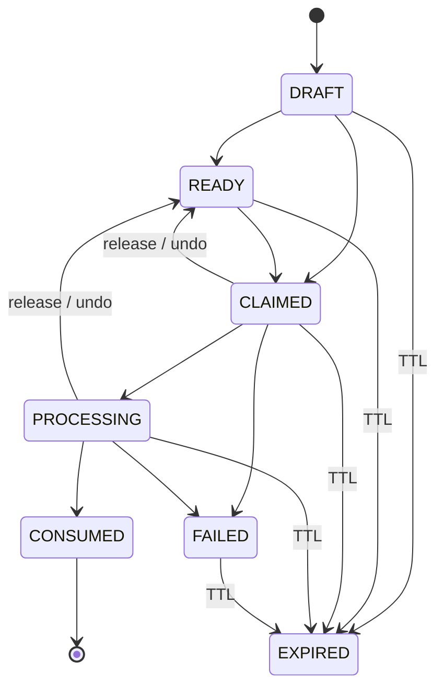

# Packet Format & Lifecycle

This document specifies the **on-disk format and lifecycle** of a Context Drop
**Context Packet**: the storage layout, the packet id scheme, the
`manifest.json` schema, the SQLite tables and their versioning, and the packet
state machine.

> **Authority model (read this first).**
> **SQLite is the single source of truth for all packet metadata.** The
> per-packet `manifest.json` file is a **projection** of that state onto disk —
> a human- and tool-readable view, not the authority. When the two disagree,
> the database wins. This lets the desktop app and the `context-drop` CLI
> coordinate through the shared database and filesystem alone — there is no
> daemon, no HTTP/websocket/DB server, and no network listener.

---

## 1. Storage layout

Context Drop stores everything under a single global per-OS-user data
directory. The application identifier / data directory leaf is
`com.contextdrop.app`, resolved as:

```
dirs::data_dir()/com.contextdrop.app
```

This matches Tauri v2's `app_data_dir`. The location can be overridden with the
`CONTEXT_DROP_DATA_DIR` environment variable (also exposed on the CLI as the
global `--data-dir <path>` flag).

The directory layout is:

```
<data-dir>/
  context-drop.db            # SQLite database (metadata authority)
  config.json                # user configuration
  packets/
    <packet-id>/
      manifest.json          # projection of DB state for this packet
      items/
        0001.png
        0002.txt
        ...
  logs/
  bin/
```

Each captured packet gets its own directory under `packets/<packet-id>/`. Item
payloads live in `items/` as zero-padded, sequentially numbered files
(`0001.png`, `0002.txt`, ...). Images are normalized to PNG at capture time.

### Filesystem permissions

On Unix, directories are created `0700` and files `0600`. On Windows, Context
Drop relies on the per-user `%APPDATA%` ACLs for isolation.

---

## 2. Packet id scheme (UUIDv7)

Packet ids are **UUIDv7**. UUIDv7 is:

- **collision-resistant** — safe for a global, multi-session store, and
- **time-ordered** — the timestamp component makes ids naturally sortable by
  creation time.

Packet ids are **never timestamp-only**. The time ordering is a property of the
UUIDv7 value itself; it does not replace the randomness that guarantees
uniqueness.

---

## 3. Manifest schema (`packets/<id>/manifest.json`)

The manifest is the on-disk **projection** of a packet's database state.
`schemaVersion` is currently **`1`**.

**Raw file contents are NEVER inlined into the manifest.** Items are recorded
as references (`relativePath`) plus content hashes (`sha256`) and sizes only.

### Top-level fields

| Field           | Type    | Notes                                                        |
| --------------- | ------- | ------------------------------------------------------------ |
| `schemaVersion` | integer | Manifest schema version. Current value: `1`.                 |
| `id`            | string  | Packet id (UUIDv7).                                          |
| `state`         | string  | Current packet state (see [§6](#6-packet-lifecycle--state-machine)). |
| `createdAt`     | string  | RFC 3339 timestamp.                                          |
| `updatedAt`     | string  | RFC 3339 timestamp.                                          |
| `items`         | array   | Item records (see below).                                   |
| `claim`         | object  | Present **only once the packet is CLAIMED** (see below).     |

### Item fields (each entry of `items[]`)

| Field          | Type    | Notes                                                        |
| -------------- | ------- | ------------------------------------------------------------ |
| `id`           | string  | Item id.                                                     |
| `kind`         | string  | Item kind / category.                                        |
| `mimeType`     | string  | MIME type of the stored item.                                |
| `relativePath` | string  | Path to the payload, relative to the packet directory (e.g. `items/0001.png`). |
| `byteSize`     | integer | Size of the payload in bytes.                                |
| `sha256`       | string  | SHA-256 hash of the payload.                                 |
| `createdAt`    | string  | RFC 3339 timestamp.                                          |

### Claim fields (`claim`, present only when CLAIMED)

| Field         | Type   | Notes                                                         |
| ------------- | ------ | ------------------------------------------------------------- |
| `sessionId`   | string | Claude Code session id (`CLAUDE_CODE_SESSION_ID`).            |
| `cwd`         | string | Working directory the claim ran from.                         |
| `projectRoot` | string | `git rev-parse --show-toplevel` in a git repo, else canonicalized `cwd`. |
| `projectName` | string | Human-readable project name.                                  |
| `configDir`   | string | *Optional*, diagnostics only.                                 |
| `claimedAt`   | string | RFC 3339 timestamp.                                           |

### Example manifest (CLAIMED, references + hashes only — no raw content)

```json
{
  "schemaVersion": 1,
  "id": "018f3a2b-7c41-7e9a-b3d2-6f0c1a9e5d84",
  "state": "CLAIMED",
  "createdAt": "2026-09-29T10:14:22Z",
  "updatedAt": "2026-09-29T10:16:05Z",
  "items": [
    {
      "id": "01",
      "kind": "image",
      "mimeType": "image/png",
      "relativePath": "items/0001.png",
      "byteSize": 184320,
      "sha256": "9f2c1e7b0a4d8f36c5b2e1a9d7f403c8ab61de245f9027cba13d8e6f45a1b2c3",
      "createdAt": "2026-09-29T10:14:22Z"
    },
    {
      "id": "02",
      "kind": "text",
      "mimeType": "text/plain",
      "relativePath": "items/0002.txt",
      "byteSize": 5120,
      "sha256": "3b1f0d9e7c62a548f01d3b9a2e6c74d81905fabc3e2d17c40986b5a2f1e3d4c5",
      "createdAt": "2026-09-29T10:14:48Z"
    },
    {
      "id": "03",
      "kind": "log",
      "mimeType": "text/plain",
      "relativePath": "items/0003.txt",
      "byteSize": 20480,
      "sha256": "a7c4e2109d3b5f68e01a2c7b9d4f306e58b1cad02f9e37b46815d9a0c2f4e6b1",
      "createdAt": "2026-09-29T10:15:31Z"
    }
  ],
  "claim": {
    "sessionId": "sess_7Qh2Vd9m",
    "cwd": "/Users/dev/prompt-flow/apps/web",
    "projectRoot": "/Users/dev/prompt-flow",
    "projectName": "prompt-flow",
    "configDir": "~/.claude",
    "claimedAt": "2026-09-29T10:16:05Z"
  }
}
```

Note that `projectRoot` is the git top level (`/Users/dev/prompt-flow`) even
though the claim ran from a monorepo subdirectory (`.../apps/web`): a monorepo
subdirectory is **not** a different project unless the git root differs.

---

## 4. Database

The metadata authority is a bundled SQLite database at
`<data-dir>/context-drop.db`, opened with:

| PRAGMA / setting  | Value        |
| ----------------- | ------------ |
| Journal mode      | WAL          |
| `busy_timeout`    | `5000` ms    |
| `foreign_keys`    | ON           |
| `synchronous`     | NORMAL       |

### Tables

| Table          | Purpose                                             |
| -------------- | --------------------------------------------------- |
| `packets`      | One row per packet, including its current state.    |
| `packet_items` | One row per captured item (references + hashes).    |
| `claims`       | Claim / routing records binding a packet to a session. |
| `settings`     | Persisted configuration values.                     |
| `migrations`   | Applied schema migrations.                          |

### Transactions & concurrency

State-changing operations run inside SQLite `BEGIN IMMEDIATE` transactions:
**finalize, claim, append-state-check, undo, and release**.

- **Claims are atomic** via `BEGIN IMMEDIATE` + a conditional `UPDATE`, so
  **exactly one session can ever claim a given packet**, even under concurrent
  claim attempts.
- **Append verifies `state == DRAFT` inside the transaction**, so an append can
  never win a race against a claim: once a packet leaves DRAFT, later appends
  are refused.

---

## 5. Schema versioning (`PRAGMA user_version`)

The database schema is versioned via SQLite's `PRAGMA user_version`. The
**current schema version is `1`**. Applied migrations are also tracked in the
`migrations` table.

This is distinct from the manifest's `schemaVersion` (also `1`): the
`user_version` PRAGMA versions the **database schema**, while the manifest's
`schemaVersion` versions the **on-disk manifest projection format**.

---

## 6. Packet lifecycle & state machine

A packet moves through the following states:

| State        | Meaning                                                        |
| ------------ | -------------------------------------------------------------- |
| `DRAFT`      | Capturing — the packet is actively collecting items.          |
| `READY`      | Capture stopped; not yet handed to a session.                 |
| `CLAIMED`    | Bound to a specific Claude Code session.                      |
| `PROCESSING` | The isolated subagent has started.                            |
| `CONSUMED`   | Done.                                                          |
| `FAILED`     | Terminal failure state.                                       |
| `EXPIRED`    | Aged out via TTL.                                             |

### Main transitions

```
DRAFT  -> READY
DRAFT  -> CLAIMED
READY  -> CLAIMED
CLAIMED -> PROCESSING
PROCESSING -> CONSUMED
```

### Recovery / terminal transitions

```
CLAIMED    -> READY      (release / undo)
PROCESSING -> READY      (release / undo)
CLAIMED    -> FAILED
PROCESSING -> FAILED
*          -> EXPIRED    (TTL)
```

### Transition diagram



### Claiming a DRAFT ends capture atomically

Routing follows a **"capture first, route later"** model: a packet has no
destination at capture time, and the destination is decided only when
`/context-drop:pull` runs from the target Claude Code session. Claiming a DRAFT
performs the `DRAFT -> CLAIMED` transition **atomically**, which ends capture;
any later append to that packet is refused (see the append-state-check rule in
[§4](#4-database)).

The routing identity persisted in the claim is `sessionId` + `cwd` +
`projectRoot` (plus `projectName`, and optionally `configDir` for diagnostics).
Routing is never derived from the most-recently-opened project, foreground app,
window title, Anthropic account, or the desktop UI selection.

### TTL cleanup

The default TTL is **24h** (configurable). Cleanup runs **only** at app startup
and when a new capture starts — there is no scheduler, cron, or background
service.

- `DRAFT` and `PROCESSING` packets are **never age-deleted**.
- Stale `READY` / `CLAIMED` / `FAILED` packets are marked `EXPIRED`, then
  removed along with terminal packets that are past their TTL.

### Undo is routing-only

`context-drop undo` (and `/context-drop:undo`) returns a packet to `READY`.
Undo affects **routing only** — it never rolls back source-code changes that a
FIX run has already made to a repository.

---

## 7. What is never written to disk in cleartext metadata

- The manifest and database store **references and hashes**, never inlined raw
  payloads. Item content lives only in `packets/<id>/items/`.
- Application logs (`logs/`) never contain clipboard raw content, file
  contents, image content, or secrets — only the packet id, item type, item
  size, state transitions, and error class.
